### `~$ whoami`

Computer science at **Franciscan University of Steubenville**, class of 2029.
Offensive security, low level systems, and hardware that does something when you plug it in.
Catholic. Always building.

  

### `~$ cat focus.txt`

| offensive security | systems | embedded | ai |
| :--- | :--- | :--- | :--- |
| pentesting, recon, exploit dev | go services, cli tooling, networking | pcb design, microcontrollers, rf | applied ml, agents, automation |

  

### `~$ ls ~/bin`

  

### `~$ ps aux | grep building`

| project | stack | |
| :--- | :--- | :--- |
| **Nexus** | Go | [`repo`](https://github.com/KieranK07/Nexus) |
| **Inspectiod** | TypeScript | [`repo`](https://github.com/KieranK07/Inspectiod) |
| **AIRC** | embedded + ai | [`repo`](https://github.com/KieranK07/AIRC) |
| **Office Hours** | Python | [`repo`](https://github.com/KieranK07/Office-Hours) |
| **PCB Business Card** | hardware | [`repo`](https://github.com/KieranK07/PCBBuisnessCard) |
| **chadnerd.lol** | HTML | [`repo`](https://github.com/KieranK07/KieranK07.github.io) |

  

### `~$ uptime`

  

  

<code>ad maiorem dei gloriam</code>

